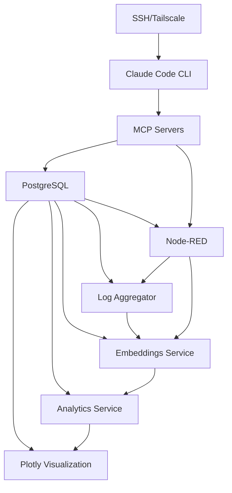

# ARM Edge AI Platform

A production-ready AI development and automation platform optimized for ARM architecture. Features vector embeddings, real-time analytics, automated workflows, and comprehensive monitoring - all designed for edge computing environments.

## 🎯 Overview

This platform showcases modern edge AI infrastructure combining machine learning, automation, and data analytics in a resource-efficient package. Perfect for IoT applications, real-time processing, and distributed AI deployments requiring minimal hardware footprint.

## 🏗️ Architecture

### System Overview
```
┌─────────────────────────────────────────────────────────────┐
│                    ARM Edge AI Platform                     │
├─────────────────────────────────────────────────────────────┤
│  Client Access: SSH + Tailscale VPN + Claude Code CLI       │
├─────────────────────────────────────────────────────────────┤
│                    MCP Server Layer                         │
│  ┌─────────────┬─────────────┬─────────────┬─────────────┐  │
│  │   Memory    │   System    │   GitHub    │  Node-RED   │  │
│  │   Server    │  Monitor    │    API      │  Control    │  │
│  └─────────────┴─────────────┴─────────────┴─────────────┘  │
├─────────────────────────────────────────────────────────────┤
│                 Automation & Orchestration                  │
│  ┌─────────────────────────────────────────────────────────┐│
│  │              Node-RED Workflows (6 flows)               ││
│  │   • Log Collection  • Event Processing  • Analytics     ││
│  └─────────────────────────────────────────────────────────┘│
├─────────────────────────────────────────────────────────────┤
│                     Service Layer                           │
│  ┌───────────┬───────────┬───────────┬───────────────────┐  │
│  │Embeddings │ Analytics │Log Aggreg │  Plotly Viz       │  │
│  │  :8001    │  :8002    │  :8004    │     :8003         │  │
│  └───────────┴───────────┴───────────┴───────────────────┘  │
├─────────────────────────────────────────────────────────────┤
│                     Data Layer                              │
│  ┌─────────────────────────────────────────────────────────┐│
│  │      PostgreSQL 16.9 + pgvector 0.8.0 + pg_net*         ││
│  │    • Vector embeddings (384-dim)                        ││
│  │    • Event queue system (polling-based)                 ││
│  │    • Analytics results                                  ││ 
│  │    • Persistent memory                                  ││
│  │    * pg_net installed but not actively used             ││ 
│  └─────────────────────────────────────────────────────────┘│
└─────────────────────────────────────────────────────────────┘
```

### Data Flow Diagram
```
┌─────────────┐    ┌─────────────┐    ┌─────────────┐    ┌─────────────┐
│   Raw Data  │───▶│  Node-RED   │───▶│ Log Aggreg  │───▶│ PostgreSQL  │
│  (Logs/API) │    │ Processing  │HTTP│   Service   │    │  + pgvector │
└─────────────┘    └─────────────┘    └─────────────┘    └─────────────┘
                         │                                          │
                         │ HTTP                              HTTP   │
                         ▼                                          ▼
┌─────────────┐    ┌─────────────┐    ┌─────────────┐    ┌─────────────┐
│   Plotly    │◀───│  Analytics  │◀───│ Embeddings  │◀───│   Claude    │
│Visualization│HTTP│   Engine    │HTTP│   Service   │    │  Webhook    │
└─────────────┘    └─────────────┘    └─────────────┘    └─────────────┘
```

### Service Dependencies


## ✨ Business Value

### Production Benefits
- **Cost Efficiency**: Run AI workloads on $100 hardware instead of expensive cloud instances
- **Low Latency**: Edge processing eliminates network round-trips for real-time applications  
- **Data Privacy**: Keep sensitive data on-premises with local AI processing
- **Scalability**: Distributed deployment model for IoT and edge computing scenarios
- **Reliability**: Autonomous operation with automated error recovery and health monitoring

### Technical Excellence
- **Modern Stack**: FastAPI, PostgreSQL, Docker, Vector databases, and async programming
- **ARM Optimization**: Efficient resource utilization on energy-efficient processors
- **Microservices**: Scalable, maintainable architecture with clear service boundaries
- **Observability**: Comprehensive logging, monitoring, and visualization capabilities
- **Developer Friendly**: Extensive documentation, examples, and API specifications

## 🚀 Key Features

### AI & Machine Learning
- **ARM-Optimized Embeddings**: SentenceTransformer using `all-MiniLM-L6-v2` model (384 dimensions)
- **Vector Storage**: PostgreSQL with pgvector for similarity search and analytics
- **Intelligent Log Processing**: Automated log analysis with pattern recognition
- **Real-time Analytics**: Vector clustering and similarity analysis

### Edge Computing
- **Resource Efficient**: Runs on Raspberry Pi 5 with ~1.7GB RAM usage
- **ARM Architecture**: All services optimized for ARM64 processors
- **Edge-to-Cloud**: Hybrid deployment with local processing and optional cloud sync
- **Network Resilience**: Continues operation during network interruptions

### Automation & Orchestration
- **Visual Workflows**: Node-RED automation with 6 production flows
- **Event-Driven**: HTTP-based event processing with polling mechanism
- **Self-Healing**: Automated error recovery and service restart
- **Batch Processing**: Efficient processing of large data sets

### Developer Experience
- **Claude Code Integration**: MCP (Model Context Protocol) servers for AI-assisted development
- **Persistent Memory**: Vector-based memory system for context retention
- **Health Monitoring**: Comprehensive system and service monitoring
- **Documentation**: Extensive documentation with examples

## 📊 Performance Metrics

**System Load** (Raspberry Pi 5):
- CPU Usage: ~5% average
- Memory Usage: 1.7GB / 8GB (21%)
- Disk Usage: 11.87GB / 469GB (2.5%)
- Network: Low latency local processing

**Service Performance**:
- Embedding Generation: ~5ms per text
- Batch Processing: 100 texts in ~150ms
- Database Queries: <10ms average
- Health Check Response: <1ms

## 🔧 Services

### Core Services
| Service | Port | Purpose | Technology |
|---------|------|---------|------------|
| **Embeddings** | 8001 | Vector generation | FastAPI + SentenceTransformers |
| **Analytics** | 8002 | Vector analysis | FastAPI + scikit-learn |
| **Log Aggregator** | 8004 | Log processing | FastAPI + PostgreSQL |
| **Plotly Viz** | 8003 | Data visualization | Plotly Dash |
| **PostgreSQL** | 5432 | Vector database | PostgreSQL 16 + pgvector |
| **Node-RED** | 1880 | Workflow automation | Node-RED with custom nodes |

### MCP Servers
- **Memory Server**: Persistent vector memory with pgvector
- **System Monitor**: Real-time system metrics and health
- **GitHub Integration**: Repository management and automation
- **Node-RED Control**: Flow management and monitoring
- **Claude Webhook**: Event processing with polling-based queue
- **PostgreSQL Interface**: Database operations and queries

## 🚀 Quick Start

### Prerequisites
- **ARM64 device**: Raspberry Pi 4/5 with 4GB+ RAM (8GB recommended)
- **Docker**: Version 20.10+ with Docker Compose
- **Git**: For repository management
- **Network**: Internet connection for initial setup

### One-Command Setup
```bash
# Clone and start the entire platform
git clone https://github.com/realunclefester/ARM-Edge-AI-Platform.git
cd ARM-Edge-AI-Platform
cp .env.example .env
# Edit .env with your passwords
docker compose up -d
```

### Verify Deployment
```bash
# Check all services are healthy
docker compose ps

# Test individual services
curl http://localhost:8001/health    # Embeddings Service
curl http://localhost:8002/health    # Analytics Service  
curl http://localhost:8004/health    # Log Aggregator
curl http://localhost:8003/          # Plotly Dashboard
curl http://localhost:1880/          # Node-RED Interface

# Check database connection
docker exec ai_platform_postgres pg_isready -U ai_platform_user
```

### First API Call
```bash
# Generate your first embedding
curl -X POST http://localhost:8001/embed/single \
  -H "Content-Type: application/json" \
  -d '{"text": "Hello from ARM Edge AI Platform!", "normalize": true}'

# Calculate text similarity
curl -X POST http://localhost:8001/similarity \
  -H "Content-Type: application/json" \
  -d '{"text1": "ARM processor", "text2": "Raspberry Pi CPU"}'
```

### Accessing Services
- **Node-RED**: http://your-rpi-ip:1880
- **Embeddings API**: http://your-rpi-ip:8001/docs
- **Analytics API**: http://your-rpi-ip:8002/docs
- **Plotly Dashboard**: http://your-rpi-ip:8003
- **Log Aggregator**: http://your-rpi-ip:8004/docs

## 📚 Documentation

- [**Architecture Overview**](./docs/architecture.md) - System design and component interaction
- [**Deployment Guide**](./docs/deployment.md) - Production deployment instructions
- [**Service Documentation**](./services/) - Individual service README files
- [**Usage Examples**](./examples/) - Practical implementation examples
- **API Reference** - Interactive docs at `http://localhost:800X/docs` for each service
- **Health Monitoring** - Built-in health endpoints and dashboard at `http://localhost:8003`

## 🔍 Use Cases

### Production Scenarios
- **Edge AI Applications**: Real-time inference with minimal latency
- **IoT Data Processing**: Intelligent processing of sensor data
- **Log Intelligence**: Automated log analysis and anomaly detection
- **Document Search**: Semantic search over document collections
- **Chatbot Backend**: Vector-based context and memory

### Development & Research
- **AI Prototyping**: Rapid development of AI applications
- **Algorithm Testing**: Experimentation with vector algorithms
- **Performance Benchmarking**: ARM performance optimization research
- **Educational Projects**: Learning edge AI development

## 🛡️ Security Features

- **Network Security**: Tailscale VPN integration for secure remote access
- **Access Control**: SSH key-based authentication only
- **Service Isolation**: Docker network isolation between services
- **Data Protection**: No sensitive data logged or exposed
- **Monitoring**: Real-time security event monitoring

## 📈 Monitoring & Observability

### Health Monitoring
- Service health endpoints with detailed status
- Resource utilization tracking (CPU, memory, disk)
- Network connectivity monitoring
- Temperature monitoring for thermal management

### Logging & Analytics
- Structured logging across all services
- Automated log aggregation and analysis
- Vector-based log similarity detection
- Performance metrics collection

## 🔮 Roadmap

### Current Status
- ✅ Core AI services operational
- ✅ Vector storage and analytics
- ✅ Automated workflow processing
- ✅ Production-ready deployment
- ✅ Comprehensive monitoring and health checks

### Future Enhancements
- 📋 Multi-node cluster support
- 📋 Advanced ML model integration
- 📋 Real-time stream processing
- 📋 Enhanced security features
- 📋 Performance optimization tools

## 🤝 Contributing

This project is actively developed for production use. Contributions are welcome for:
- Performance optimizations
- Additional AI models
- Enhanced monitoring
- Documentation improvements

## 📄 License

MIT License - see [LICENSE](./LICENSE) file for details

## 🛠️ Technology Stack

### Core Technologies
- **Python 3.11+**: Primary language with async/await patterns
- **FastAPI**: High-performance async web framework for all services
- **PostgreSQL 16.9 + pgvector**: Vector database with similarity search
- **Docker & Docker Compose**: Containerization and orchestration
- **Node-RED**: Visual workflow automation and integration

### AI & Analytics
- **SentenceTransformers**: ARM-optimized embedding generation
- **scikit-learn**: Machine learning algorithms for clustering and analysis
- **NumPy**: Efficient numerical computing and vector operations
- **Plotly Dash**: Interactive data visualization and dashboards

### Infrastructure
- **ARM64 Architecture**: Optimized for Raspberry Pi and edge devices
- **MCP (Model Context Protocol)**: AI-assistant integration framework
- **AsyncIO**: Non-blocking I/O for high-performance operations
- **Tailscale VPN**: Secure remote access and networking

## 🏆 Project Highlights

**Enterprise-Grade Edge AI Solution** showcasing:
- Modern microservices architecture with clear separation of concerns
- Production-ready deployment with health monitoring and error recovery
- ARM-specific optimizations for energy-efficient computing
- Comprehensive documentation and testing examples
- Integration with cutting-edge AI development tools (Claude Code)

---

**Status**: 🟢 Production deployment running 24/7 on Raspberry Pi 5  
**Last Updated**: January 2025  
**Tested On**: Raspberry Pi 5 (8GB), ARM64 architecture
