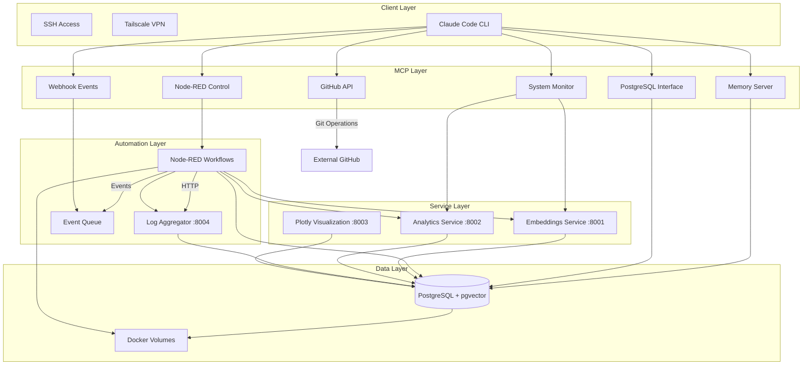

# Architecture Overview

## System Architecture

The ARM Edge AI Platform is designed as a microservices architecture optimized for ARM-based edge computing devices, particularly Raspberry Pi. The platform emphasizes autonomous operation, efficient resource utilization, and production-grade reliability.

## Component Interaction



## Service Architecture

### Core Services

#### 1. Embeddings Service (Port 8001)
- **Technology**: FastAPI + SentenceTransformers
- **Model**: all-MiniLM-L6-v2 (384 dimensions)
- **Optimization**: ARM-specific model caching
- **Features**: 
  - Single and batch embedding generation
  - Similarity calculations
  - Database integration for storage
  - Health monitoring with database status

#### 2. Analytics Service (Port 8002)
- **Technology**: FastAPI + scikit-learn + NumPy
- **Purpose**: Vector analysis and clustering
- **Features**:
  - K-means clustering of embeddings
  - Similarity search and ranking
  - Statistical analysis of vector spaces
  - Batch processing capabilities

#### 3. Log Aggregator (Port 8004)
- **Technology**: FastAPI + asyncpg
- **Purpose**: Intelligent log processing and storage
- **Features**:
  - Multi-source log ingestion
  - Automatic log aggregation
  - Metadata extraction and enrichment
  - Batch processing with database triggers

#### 4. Plotly Visualization (Port 8003)
- **Technology**: Plotly Dash
- **Purpose**: Interactive data visualization
- **Features**:
  - 3D vector space visualization
  - Real-time analytics dashboards
  - Interactive exploration tools
  - Export capabilities

#### 5. PostgreSQL Database (Port 5432)
- **Technology**: PostgreSQL 16.9 + pgvector 0.8.0 + pg_net (installed but not used)
- **Purpose**: Vector storage and relational data
- **Features**:
  - 384-dimensional vector storage
  - Similarity search with pgvector
  - Event queue system (polling-based)
  - HTTP-ready with pg_net extension

#### 6. Node-RED Automation (Port 1880)
- **Technology**: Node-RED with custom nodes
- **Purpose**: Workflow orchestration and automation
- **Features**:
  - Visual workflow design
  - Database integration
  - Event-driven processing
  - Error handling and recovery

### MCP Server Layer

The Model Context Protocol (MCP) servers provide structured interfaces for Claude Code integration:

#### Memory Server
- Manages persistent vector memory using pgvector
- Provides context storage and retrieval
- Handles embedding generation and similarity search

#### System Monitor
- Real-time system metrics collection
- Service health monitoring
- Resource utilization tracking
- Temperature and performance monitoring

#### GitHub Integration
- Repository management and operations
- Automated Git workflows
- Issue and PR management
- Documentation automation

#### Node-RED Control
- Flow management and monitoring
- Node deployment and configuration
- Runtime status and debugging
- Performance analytics

#### Claude Webhook
- Event queue management using polling mechanism
- Database-backed event storage
- HTTP endpoint integration
- Pending event processing on startup

#### PostgreSQL Interface
- Database operations and queries
- Schema management
- Performance monitoring
- Backup and maintenance automation

## Data Flow Architecture

### Log Processing Pipeline
```
Log Sources → Node-RED → Log Aggregator → PostgreSQL → Embeddings → Analytics
```

1. **Collection**: Multiple sources via Node-RED HTTP endpoints
2. **Preprocessing**: Node-RED flows filter and enrich log data
3. **Aggregation**: Log Aggregator service processes and stores logs
4. **Processing**: HTTP-based communication between services
5. **Embedding**: Vector generation via Embeddings API
6. **Analytics**: Clustering and similarity analysis
7. **Storage**: Final results stored in vector database

### Vector Memory Pipeline
```
Input Text → Embeddings Service → pgvector Storage → Memory Server → Context Retrieval
```

1. **Input Processing**: Text normalization and validation
2. **Vector Generation**: ARM-optimized embedding computation
3. **Storage**: Direct pgvector storage with metadata
4. **Indexing**: Automatic similarity indexing
5. **Retrieval**: Context-aware memory lookup

## Network Architecture

### Internal Communication
- **Docker Network**: ai_platform_network
- **Service Discovery**: DNS-based service resolution
- **API Communication**: HTTP/REST between all services
- **Health Checks**: HTTP-based health endpoints

### External Access
- **SSH**: Port 22 (key-based authentication only)
- **Tailscale VPN**: Secure remote access
- **Service Ports**: 1880, 5432, 8001-8004
- **Network Security**: iptables configuration

## Resource Management

### Memory Optimization
- **Model Caching**: Pre-loaded during Docker build
- **Connection Pooling**: Shared database connections
- **Vector Storage**: Efficient pgvector indexing
- **Garbage Collection**: Automatic cleanup of temporary data

### CPU Optimization
- **ARM-Specific**: Native ARM64 compilation
- **Async Processing**: Non-blocking I/O operations
- **Batch Processing**: Vectorized operations
- **Process Isolation**: Container-based resource limits

### Storage Optimization
- **Volume Management**: Persistent Docker volumes
- **Database Tuning**: PostgreSQL optimization for ARM
- **Log Rotation**: Automatic log cleanup
- **Compression**: Efficient data storage formats

## Security Architecture

### Access Control
- **SSH Keys**: Public key authentication only
- **VPN Access**: Tailscale-based secure tunneling
- **Service Isolation**: Docker network segmentation
- **Privilege Separation**: Non-root container execution

### Data Protection
- **Encryption**: TLS for external communications
- **Input Validation**: Comprehensive request validation
- **SQL Injection**: Parameterized queries only
- **Secret Management**: Environment-based configuration

### Monitoring & Auditing
- **Access Logging**: Comprehensive access logs
- **Security Events**: Real-time security monitoring
- **Health Checks**: Continuous service monitoring
- **Alerting**: Automated security notifications

## Deployment Architecture

### Container Orchestration
- **Docker Compose**: Multi-service deployment
- **Health Checks**: Automatic restart on failure
- **Resource Limits**: CPU and memory constraints
- **Volume Management**: Persistent data storage

### Configuration Management
- **Environment Variables**: Service configuration
- **Secret Management**: Secure credential storage
- **Configuration Files**: Version-controlled settings
- **Hot Reload**: Dynamic configuration updates

### Monitoring & Observability
- **Health Endpoints**: Service-level health checks
- **Metrics Collection**: Performance and usage metrics
- **Log Aggregation**: Centralized logging
- **Alerting**: Proactive issue notification

## Scalability Considerations

### Horizontal Scaling
- **Stateless Services**: Enable multiple instances
- **Load Balancing**: Distribute requests efficiently
- **Database Scaling**: Read replicas and sharding
- **Caching**: Reduce database load

### Vertical Scaling
- **Resource Monitoring**: Track utilization patterns
- **Performance Tuning**: Optimize for ARM architecture
- **Memory Management**: Efficient memory usage
- **CPU Optimization**: Maximize ARM processor efficiency

## Future Architecture Enhancements

### Planned Improvements
- **AI Router**: Intelligent request routing based on content
- **Cluster Support**: Multi-node deployment capability
- **Advanced Security**: Enhanced iptables configuration
- **Stream Processing**: Real-time data stream handling
- **Metrics Integration**: Prometheus and Grafana deployment

### Technology Roadmap
- **Model Expansion**: Support for additional AI models
- **Edge-to-Cloud**: Hybrid deployment strategies
- **Performance Optimization**: Further ARM-specific tuning
- **Security Hardening**: Advanced security measures
- **Monitoring Enhancement**: Comprehensive observability stack
