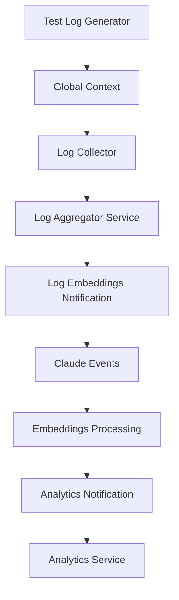

# Node-RED Flows Documentation

This directory contains documentation for all active Node-RED flows in the AI platform.

## Active Flows Overview

### 1. **Log Collector Flow** (`log_collector_flow.md`)
- **Purpose:** Collects generated logs and forwards to log aggregator
- **Status:** Active, Locked
- **Trigger:** Reads from global context
- **Output:** Sends to log aggregator service

### 2. **Claude Events Flow** (`claude_events_flow.md`)
- **Purpose:** HTTP endpoint for receiving Claude events
- **Status:** Active, Locked  
- **Endpoint:** `POST /claude-events`
- **Storage:** PostgreSQL `claude_events` table

### 3. **Log Embeddings Notification Flow** (`log_embeddings_notification_flow.md`)
- **Purpose:** Monitors for unprocessed logs and creates embeddings requests
- **Status:** Active, Locked
- **Endpoint:** `POST /logs-batch-ready`
- **Queries:** `aggregated_logs` and `embeddings_history`

### 4. **Embeddings Processing Flow** (`embeddings_processing_flow.md`)
- **Purpose:** Processes approved embeddings and stores results
- **Status:** Active, Locked
- **Endpoint:** `POST /process-embeddings`
- **Integration:** Embeddings service and database storage

### 5. **Analytics Notification Flow** (`analytics_notification_flow.md`)
- **Purpose:** Triggers analytics processing when embeddings are ready
- **Status:** Active, Locked
- **Endpoint:** `POST /embeddings-ready`
- **Integration:** Analytics service

## Disabled Flows

### Test Log Generator Flow
- **Purpose:** Generates test logs for development
- **Status:** Disabled
- **Note:** Used for testing the pipeline, disabled in production

## Flow Interconnections

## Database Configuration

All flows use the same PostgreSQL configuration:
- **Host:** postgres:5432
- **Database:** claude_ai_db
- **User:** postgres
- **Password:** de2b1A7Rd1BnoJTm
- **Connection Pool:** Max 10 connections

## HTTP Endpoints Summary

| Endpoint | Method | Flow | Purpose |
|----------|--------|------|---------|
| `/claude-events` | POST | Claude Events | Receive Claude notifications |
| `/logs-batch-ready` | POST | Log Embeddings | Trigger embeddings processing |
| `/process-embeddings` | POST | Embeddings Processing | Execute embeddings generation |
| `/embeddings-ready` | POST | Analytics Notification | Trigger analytics processing |

## Service Integrations

### External Services Called
- **Log Aggregator:** `http://log-aggregator:8004/logs/ingest`
- **Embeddings Service:** `http://embeddings:8001/embed`
- **Analytics Service:** `http://analytics-node:8002/analyze/pre-storage`

### Internal Endpoints
- **Claude Events:** `http://node-red:1880/claude-events`
- **Embeddings Ready:** `http://node-red:1880/embeddings-ready`

## Data Flow Pipeline

1. **Log Generation** → Test generator creates logs in global context
2. **Log Collection** → Collector reads and forwards to aggregator
3. **Log Aggregation** → Service processes and stores in `aggregated_logs`
4. **Embeddings Notification** → Flow detects unprocessed logs
5. **Claude Decision** → Event created for embeddings approval
6. **Embeddings Processing** → Approved logs sent to embeddings service
7. **Embeddings Storage** → Results stored in `embeddings_history`
8. **Analytics Trigger** → Notification sent for analytics processing
9. **Analytics Processing** → Service analyzes embeddings data

## Error Handling

All flows include:
- Debug nodes for monitoring
- Error catching mechanisms  
- Graceful handling of empty data
- Status updates for tracking

## Performance Considerations

- **Batch Processing:** Flows process data in configurable batches
- **Connection Pooling:** PostgreSQL connections are pooled
- **Async Processing:** HTTP calls are non-blocking
- **Memory Management:** Global context limited to prevent memory issues

## Development Notes

- Flows are locked to prevent accidental modifications
- Debug outputs active for monitoring
- Test flow disabled in production
- Flow context used for data sharing between related flows